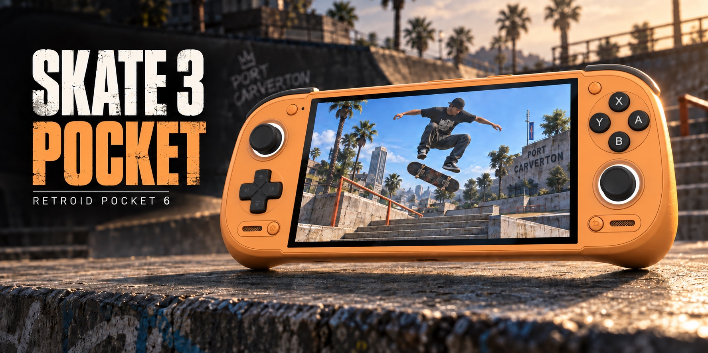

# Skate 3 Pocket

[Download the APK](https://github.com/AlanConstantino/skate3-pocket/releases/latest) · [Build from source](docs/BUILDING.md) · [Report a problem](https://github.com/AlanConstantino/skate3-pocket/issues)

An unofficial Android fork of [Andrew Nakas's Skate 3 Android](https://github.com/andrewnakas/skate3-android), focused on handheld controls and easy GPU driver switching.

Skate 3 Pocket builds on Andrew's working **v0.1.19** release. It adds a Turnip driver manager, controller fixes tested on the Retroid Pocket 6, and reliable restarts when changing drivers. The native game engine is preserved from Andrew's release.

You must provide your own legally obtained Xbox 360 copy of Skate 3. No retail game files are bundled with the app.

## Install

Download the APK from this repository's Releases page. The app appears as **Skate 3 Pocket** and requires Android 9 or newer, ARM64, and Vulkan. Bundled T30 requires Android 11 or newer and a compatible Adreno GPU. Custom Turnip support has been checked on the Retroid Pocket 6; device and driver compatibility varies.

Provide your own Xbox 360 disc image and the supported Title Update 3 through the setup screen. Allow about 7 GB for extracted game data.

The public package is `io.github.alanconstantino.skate3pocket`. It installs separately from Andrew's app and earlier private test builds. Android does not automatically transfer their saves or game files; keep your existing installation until you have copied or reinstalled the data you need.

## GPU driver switching

Keep multiple compatible Android ARM64 Turnip drivers installed and switch between them from the launcher. Bundled **MrPurple T30** and your device's **System GPU driver** remain available.

1. Open **GPU driver** on the launcher.
2. Tap **Import driver ZIP…** and select a compatible Turnip ZIP. Leave the ZIP compressed.
3. Highlight the driver and tap **Apply and restart**.
4. Use **Check selected driver** to confirm that it loads, then press **PLAY**.

Driver changes do not require another APK. To remove an imported driver, apply another driver and restart first, then return to the manager and choose **Remove highlighted driver**.

The importer checks the archive, metadata, ARM64 libraries, and file integrity before installing it. These checks cannot guarantee that every Turnip release performs well with the game. If a driver fails, reopen the launcher and apply T30 or System.

## Tested on Retroid Pocket 6

The driver manager was tested on a 12 GB Retroid Pocket 6 running Android 13. Verification covered imports, removal, failed-import recovery, saved selections, and switching between T30, imported Turnip R7, and System. All three passed native driver initialization checks.

The import and selection tests passed **25 cases and 428 assertions**. The working native engine and controller implementation were preserved during the driver-manager update. This verification did not establish which driver delivers the best frame rate.

## Credits

This project builds on the work of the following developers and projects:

- **[Andrew Nakas — Skate 3 Android](https://github.com/andrewnakas/skate3-android):** the Android application, platform work, and v0.1.19 engine release used by this project.
- **[Alex McHugh — Skate3Recomp](https://github.com/mchughalex/skate3recomp):** the Skate 3 recompilation and native renderer.
- **[Alex McHugh's Skate-specific ReXGlue runtime](https://github.com/mchughalex/rexglue-skate3)** and **[Andrew's runtime fork](https://github.com/andrewnakas/rexglue-skate3):** the Skate-specific runtime lineage.
- **[ReXGlue](https://github.com/rexglue/rexglue-sdk)** and **[Xenia](https://github.com/xenia-project/xenia):** the recompilation tools, runtime foundations, and Xbox 360 research.
- **[Mesa / Turnip](https://docs.mesa3d.org/drivers/freedreno.html), MrPurple, and other driver contributors:** the Vulkan drivers that make custom driver selection useful. MrPurple's T30 is the bundled driver.
- **[Billy Laws — libadrenotools](https://github.com/bylaws/libadrenotools)** and its linker namespace support: loading compatible custom Adreno drivers inside the app.
- **[SDL](https://www.libsdl.org/)** and the other upstream dependencies: input, audio, windowing, and supporting infrastructure.

Alan Constantino maintains the additions in this variant, including the driver manager and Retroid Pocket 6 integration and testing. The original game, recompilation, renderer, drivers, and upstream platform work remain credited to their respective creators.

## Build and provenance

The [build guide](docs/BUILDING.md) documents the required tools and reproducible input preparation. The build compiles this fork's Android shell and Vulkan loader around the exact native engine from Andrew's v0.1.19 APK; it does not rebuild that engine from its complete source tree. The input versions and checksums are pinned in the source lock file.

Original upstream documentation is retained in [README-upstream.md](docs/README-upstream.md). Component notices and available source references are preserved in this repository and in the app's **About Skate 3 Pocket** screen. Upstream components retain their own copyright and licensing terms.

## Support Skate 3 Pocket

If Skate 3 Pocket is useful to you, you can support **Alan Constantino's development, maintenance, and testing of this fork** through PayPal. Donations are optional, and the app remains free.

PayPal: **@alanconstantino**

---

Skate 3 is a game by EA Black Box / Electronic Arts. Skate 3 Pocket is an unofficial community project.
